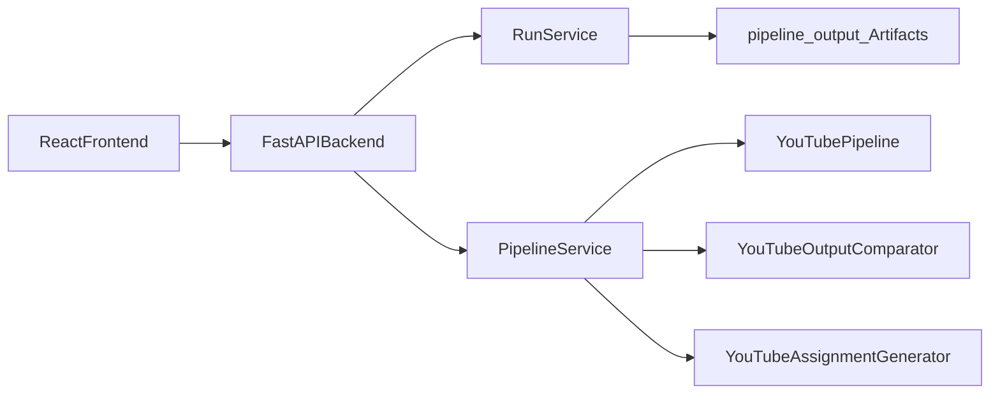

# Atlas

> AI-powered content analysis platform for technical education workflows

Atlas combines a YouTube analysis pipeline, comparison analysis, and assignment generation into a single product-oriented experience. The current application uses a `FastAPI` backend and a React frontend while preserving the original Python pipeline modules for search, transcript extraction, summarization, comparison, and educational content generation.

## What Atlas Does

### YouTube analysis pipeline
- Search YouTube videos from a natural language query
- Fetch subtitles and transcripts for selected videos
- Generate structured AI summaries focused on technical learning outcomes
- Compare multiple videos across depth, difficulty, teaching style, and audience fit
- Generate educational assignments from the analyzed content

### Product interface
- Browse existing pipeline runs
- Explore videos, transcripts, summaries, comparison outputs, and assignments in a modern React UI
- Trigger fresh pipeline steps through the API when credentials are available

## Tech Stack

### Backend
- `FastAPI`
- `Pydantic`
- Python 3.13
- Existing pipeline modules in `src/`

### Frontend
- React
- TypeScript
- Vite
- Tailwind CSS
- TanStack Query
- Framer Motion

## Architecture

Atlas is split into a typed API layer and a React client, while the core domain logic remains in the original Python modules.



### Backend responsibilities
- Expose run metadata and artifact endpoints
- Wrap the existing YouTube workflow
- Read pipeline artifacts from `pipeline_output_*` folders
- Provide execution endpoints for live searches and downstream pipeline steps

### Frontend responsibilities
- Load the latest available run
- Render structured search, transcript, summary, comparison, and assignment views
- Trigger new runs and artifact generation through the API

## Core Modules

### Existing domain modules
- `src/youtube_pipeline.py`
- `src/compare_youtube_outputs.py`
- `src/assignment_generator.py`
- `src/fetch_youtube_transcript.py`
- `src/summarize_youtube_transcript.py`

### Backend API layer
- `backend/main.py`
- `backend/routers/runs.py`
- `backend/routers/pipeline.py`
- `backend/services/run_service.py`
- `backend/services/pipeline_service.py`
- `backend/services/artifact_readers.py`

### Frontend application
- `frontend/src/App.tsx`
- `frontend/src/features/pipeline/pipeline-dashboard.tsx`
- `frontend/src/lib/api.ts`
- `frontend/src/lib/types.ts`

## Project Structure

```text
atlas/
├── backend/                        # FastAPI application
│   ├── main.py
│   ├── routers/
│   ├── schemas/
│   └── services/
├── frontend/                       # React + Vite frontend
│   ├── src/
│   ├── package.json
│   └── vite.config.ts
├── src/                            # Existing Python domain logic
│   ├── youtube_pipeline.py
│   ├── compare_youtube_outputs.py
│   ├── assignment_generator.py
│   └── configs/config.yaml
├── pipeline_output_*/              # YouTube pipeline artifacts
├── requirements.txt
└── README.md
```

## Setup

### Prerequisites
- `uv` (Python package manager, install from https://docs.astral.sh/uv/getting-started/installation/)
- Node.js 18+
- npm
- OpenRouter API key
- YouTube Data API key

### 1. Clone the repository

```bash
git clone https://github.com/ishandutta0098/atlas
cd atlas
```

### 2. Create Python environment and install dependencies

```bash
uv sync --locked --no-dev
```

This creates a `.venv` with Python 3.13.13 and installs locked dependencies from `uv.lock`.

### 3. Install frontend dependencies

```bash
cd frontend
npm install
cd ..
```

### 4. Configure environment variables

Create or update `.env` in the repository root:

```bash
OPENROUTER_API_KEY=your_openrouter_key
YOUTUBE_API_KEY=your_youtube_key
```

## Running Atlas

Atlas runs as two processes during development: the FastAPI backend and the React frontend.

### 1. Start the backend

From the repository root:

```bash
uv run uvicorn backend.main:app --reload --host 127.0.0.1 --port 8000
```

Backend health endpoint:

```text
http://127.0.0.1:8000/api/health
```

### 2. Start the frontend

In a second terminal:

```bash
cd frontend
npm run dev
```

Frontend development URL:

```text
http://127.0.0.1:5173
```

The Vite dev server proxies `/api` requests to `http://127.0.0.1:8000` via `frontend/vite.config.ts`.

## Build Commands

### Frontend

```bash
cd frontend
npm run lint
npm run build
```

### Backend smoke check

```bash
uv run python -c "from fastapi.testclient import TestClient; from backend.main import app; client = TestClient(app); print(client.get('/api/health').json())"
```

### Python verification

```bash
uv sync --locked --dev
uv run ruff check .
uv run pytest
uv pip check
```

## Development with the Launcher

For a one-command development start on Windows:

```powershell
.\scripts\start-dev.ps1
```

This uses `uv` to manage the Python 3.13.13 environment and locked dependencies automatically.

## API Overview

### Run and artifact endpoints
- `GET /api/runs`
- `GET /api/runs/latest`
- `GET /api/runs/{run_id}`
- `GET /api/runs/{run_id}/videos`
- `GET /api/runs/{run_id}/transcripts`
- `GET /api/runs/{run_id}/summaries`
- `GET /api/runs/{run_id}/comparison`
- `GET /api/runs/{run_id}/assignments`

### Pipeline execution endpoints
- `POST /api/pipeline/search`
- `POST /api/runs/{run_id}/transcripts`
- `POST /api/runs/{run_id}/summaries`
- `POST /api/runs/{run_id}/comparison`
- `POST /api/runs/{run_id}/assignments`

## Application Flow

### YouTube workflow
1. Submit a query through the frontend
2. Backend creates or reuses a pipeline run
3. Video metadata is exposed from run artifacts
4. Transcript, summary, comparison, and assignment artifacts are read or generated
5. The frontend renders each stage as a separate structured view

## Configuration

Primary runtime configuration lives in `src/configs/config.yaml`.

Important settings include:
- OpenRouter model selection
- worker counts and concurrency behavior
- transcript language defaults
- YouTube API settings
- prompt paths and output directory settings

## Data and Storage

### YouTube artifacts
Each pipeline run writes files under a `pipeline_output_<timestamp>` folder:
- `metadata/search_results_*.json`
- `metadata/fetch_results_*.json`
- `metadata/summary_results_*.json`
- `transcripts/*.srt`
- `summaries/*_summary.json`
- `assignments/*_assignment.md`

## Legacy Interface

The original Gradio application still exists in `app.py` as a legacy interface, but the primary development path is now the FastAPI backend plus the React frontend.

## License

MIT License. See `LICENSE` for details.
